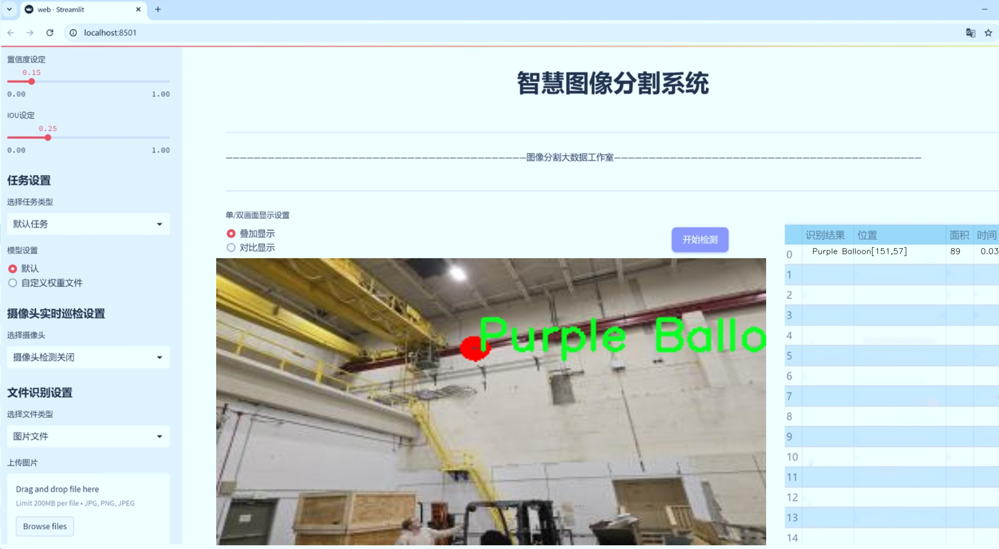
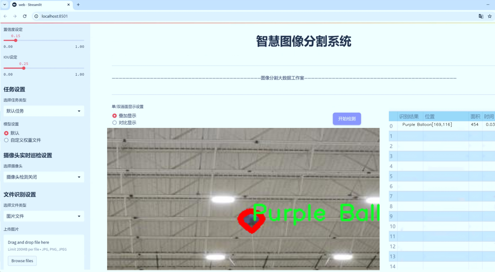
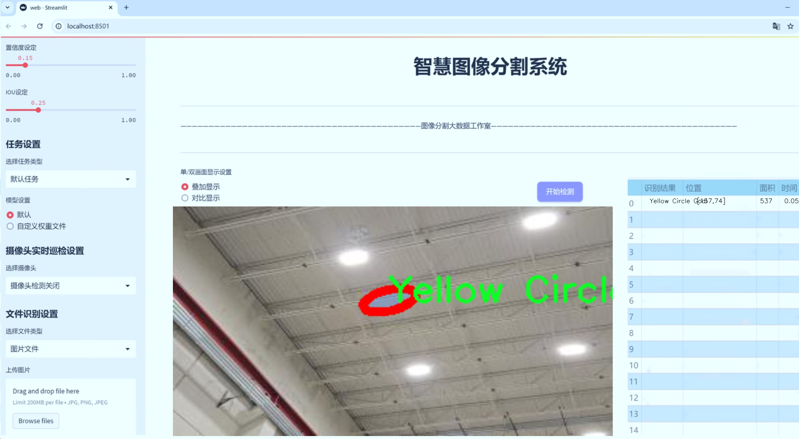
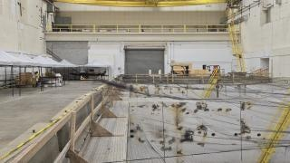
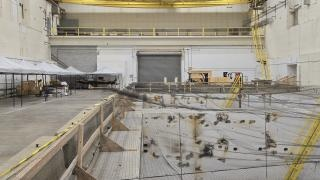
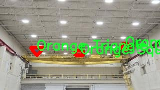
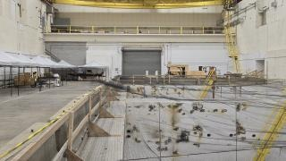
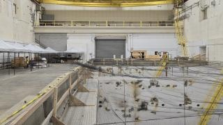

# 气球图像分割系统： yolov8-seg-swintransformer

### 1.研究背景与意义

[参考博客](https://gitee.com/YOLOv8_YOLOv11_Segmentation_Studio/projects)

[博客来源](https://kdocs.cn/l/cszuIiCKVNis)

研究背景与意义

随着计算机视觉技术的迅猛发展，图像分割作为其中的重要任务之一，已经在多个领域中展现出其广泛的应用潜力。尤其是在自动驾驶、医疗影像分析以及智能监控等领域，精确的图像分割技术能够显著提高系统的智能化水平和应用效果。近年来，YOLO（You Only Look Once）系列模型因其高效的实时目标检测能力而受到广泛关注，尤其是YOLOv8的推出，进一步提升了目标检测和分割的性能。然而，尽管YOLOv8在许多应用场景中表现出色，但在特定的细粒度目标分割任务中，仍然存在一定的局限性。因此，基于改进YOLOv8的气球图像分割系统的研究具有重要的理论意义和实际应用价值。

气球作为一种常见的物体，其在图像中的多样性和复杂性为图像分割带来了挑战。根据所使用的数据集“Cats-and-Dogs”，该数据集包含1500张图像，涵盖了9个类别，其中包括多种颜色和形状的气球及其目标。这些目标的多样性不仅为模型的训练提供了丰富的样本，也为图像分割算法的设计提出了更高的要求。通过对这些图像进行细致的分割，可以有效地识别和提取出气球及其相关目标，从而为后续的分析和应用奠定基础。

在现有的YOLOv8模型中，尽管其在目标检测上表现优异，但在处理复杂背景、遮挡和多目标交互等情况下，分割精度仍有待提高。因此，改进YOLOv8以适应气球图像分割的需求，成为了本研究的核心目标。通过引入更为先进的图像处理技术和深度学习算法，结合气球图像的特征，能够有效提升模型的分割性能，进而实现对气球目标的高精度识别与分割。

此外，气球图像分割系统的研究不仅限于学术领域，其在实际应用中也具有广泛的前景。例如，在娱乐行业，气球常用于庆祝活动的装饰，通过自动化的图像分割技术，可以实现对活动现场的实时监控与分析，提升活动的安全性和趣味性。在教育领域，气球图像分割系统可以应用于儿童教育，通过图像识别与互动，帮助孩子们更好地理解颜色和形状的概念。

综上所述，基于改进YOLOv8的气球图像分割系统的研究，不仅具有重要的学术价值，也为实际应用提供了新的思路和方法。通过深入探索和解决气球图像分割中的挑战，能够推动计算机视觉技术的发展，促进相关领域的创新与应用，为未来的研究奠定坚实的基础。

### 2.图片演示







注意：本项目提供完整的训练源码数据集和训练教程,由于此博客编辑较早,暂不提供权重文件（best.pt）,需要按照6.训练教程进行训练后实现上图效果。

### 3.视频演示

[3.1 视频演示](https://www.bilibili.com/video/BV1ikB1YxEE8/)

### 4.数据集信息

##### 4.1 数据集类别数＆类别名

nc: 9
names: ['Balloons', 'Green Balloon', 'Orange Circle Goal', 'Orange Square Goal', 'Orange Triangle Goal', 'Purple Balloon', 'Yellow Circle Goal', 'Yellow Square Goal', 'Yellow Triangle Goal']


##### 4.2 数据集信息简介

数据集信息展示

在本研究中，我们构建了一个专门用于训练改进YOLOv8-seg的气球图像分割系统的数据集，名为“Cats-and-Dogs”。该数据集的设计旨在为气球及其相关目标的图像分割提供丰富的样本，以提升模型在实际应用中的表现。数据集包含9个类别，涵盖了多种颜色和形状的气球及目标，具体类别包括：气球（Balloons）、绿色气球（Green Balloon）、橙色圆形目标（Orange Circle Goal）、橙色方形目标（Orange Square Goal）、橙色三角形目标（Orange Triangle Goal）、紫色气球（Purple Balloon）、黄色圆形目标（Yellow Circle Goal）、黄色方形目标（Yellow Square Goal）和黄色三角形目标（Yellow Triangle Goal）。

在数据集的构建过程中，我们注重样本的多样性和代表性，确保每个类别都包含足够的图像，以便模型能够学习到不同形状和颜色的气球特征。数据集中的图像来源于多个场景，包括室内和室外环境，旨在模拟真实世界中气球的各种出现方式。每个类别的图像均经过精心挑选和标注，确保标注的准确性和一致性，从而为后续的模型训练提供高质量的数据基础。

气球作为一种常见的装饰物，广泛应用于庆祝活动、派对和节日等场合，因此在图像分割任务中，准确识别和分割气球的能力至关重要。通过使用“Cats-and-Dogs”数据集，我们希望能够训练出一个能够有效区分不同类型气球及其目标的图像分割模型。该模型不仅能够识别气球的存在，还能准确地分割出气球的轮廓，为后续的图像处理和分析提供便利。

此外，数据集中每个类别的样本数量经过精心设计，以确保模型在训练过程中不会出现类别不平衡的问题。我们在每个类别中都力求保持样本数量的均衡，使得模型在学习过程中能够充分理解每个类别的特征，从而提高整体的分割精度。通过对数据集的不断扩充和优化，我们期望能够提升模型在复杂场景下的鲁棒性，使其能够在不同光照、背景和遮挡条件下，依然保持良好的分割性能。

在训练过程中，我们将采用数据增强技术，如旋转、缩放、翻转等，以进一步增加数据集的多样性，帮助模型更好地泛化。数据增强不仅可以提升模型的准确性，还能减少过拟合的风险，使得模型在面对未知数据时，依然能够保持较高的识别率。

综上所述，“Cats-and-Dogs”数据集为改进YOLOv8-seg的气球图像分割系统提供了坚实的基础。通过对气球及其目标的细致分类和标注，我们期望能够训练出一个高效、准确的图像分割模型，为气球的自动识别和处理提供强有力的支持。随着研究的深入，我们相信该数据集将为相关领域的研究者和开发者提供宝贵的参考和借鉴。











### 5.项目依赖环境部署教程（零基础手把手教学）

[5.1 环境部署教程链接（零基础手把手教学）](https://www.bilibili.com/video/BV1jG4Ve4E9t/?vd_source=bc9aec86d164b67a7004b996143742dc)


[5.2 安装Python虚拟环境创建和依赖库安装视频教程链接（零基础手把手教学）](https://www.bilibili.com/video/BV1nA4VeYEze/?vd_source=bc9aec86d164b67a7004b996143742dc)

### 6.手把手YOLOV8-seg训练视频教程（零基础手把手教学）

[6.1 手把手YOLOV8-seg训练视频教程（零基础小白有手就能学会）](https://www.bilibili.com/video/BV1cA4VeYETe/?vd_source=bc9aec86d164b67a7004b996143742dc)


按照上面的训练视频教程链接加载项目提供的数据集，运行train.py即可开始训练



     Epoch   gpu_mem       box       obj       cls    labels  img_size
     1/200     0G   0.01576   0.01955  0.007536        22      1280: 100%|██████████| 849/849 [14:42<00:00,  1.04s/it]
               Class     Images     Labels          P          R     mAP@.5 mAP@.5:.95: 100%|██████████| 213/213 [01:14<00:00,  2.87it/s]
                 all       3395      17314      0.994      0.957      0.0957      0.0843

     Epoch   gpu_mem       box       obj       cls    labels  img_size
     2/200     0G   0.01578   0.01923  0.007006        22      1280: 100%|██████████| 849/849 [14:44<00:00,  1.04s/it]
               Class     Images     Labels          P          R     mAP@.5 mAP@.5:.95: 100%|██████████| 213/213 [01:12<00:00,  2.95it/s]
                 all       3395      17314      0.996      0.956      0.0957      0.0845

     Epoch   gpu_mem       box       obj       cls    labels  img_size
     3/200     0G   0.01561    0.0191  0.006895        27      1280: 100%|██████████| 849/849 [10:56<00:00,  1.29it/s]
               Class     Images     Labels          P          R     mAP@.5 mAP@.5:.95: 100%|███████   | 187/213 [00:52<00:00,  4.04it/s]
                 all       3395      17314      0.996      0.957      0.0957      0.0845


### 7.50+种全套YOLOV8-seg创新点加载调参实验视频教程（一键加载写好的改进模型的配置文件）

[7.1 50+种全套YOLOV8-seg创新点加载调参实验视频教程（一键加载写好的改进模型的配置文件）](https://www.bilibili.com/video/BV1Hw4VePEXv/?vd_source=bc9aec86d164b67a7004b996143742dc)

### YOLOV8-seg算法简介

原始YOLOv8-seg算法原理

YOLOv8-seg算法是YOLO系列模型中的最新版本，专注于目标检测和实例分割任务。作为YOLOv8的一个重要扩展，YOLOv8-seg不仅继承了前代模型的优点，还在架构和功能上进行了诸多创新，旨在提升模型的检测精度和运行效率。YOLOv8-seg的设计理念在于通过高效的特征提取和精确的目标定位，实现对复杂场景中目标的快速而准确的识别与分割。

首先，YOLOv8-seg的网络结构主要由三个核心部分组成：Backbone、Neck和Head。Backbone部分负责特征提取，采用了CSPDarknet结构，旨在通过分层的特征提取实现对图像信息的深入理解。CSPDarknet的设计理念是将网络分为两个部分，每个部分都包含多个残差块，从而增强特征提取的能力。与前代模型YOLOv5相比，YOLOv8-seg引入了C2f模块替代了C3模块。C2f模块的设计使得输入特征图被分为两个分支，每个分支经过卷积层进行降维处理，并且通过Bottleneck层的改进，形成了更高维度的特征图。这种结构的优势在于它能够有效地增强梯度流动，促进信息的传递和融合，从而提升模型的学习能力。

在特征提取的过程中，YOLOv8-seg还引入了快速空间金字塔池化（SPPF）结构。这一结构能够在不同尺度上提取特征，进而有效减少模型的参数量和计算量，同时提高特征提取的效率。通过这种多尺度特征提取，YOLOv8-seg能够更好地适应不同大小和形状的目标，提升检测的鲁棒性。

接下来，Neck部分采用了特征金字塔网络（FPN）与路径聚合网络（PAN）的结合。这一结构通过多个卷积层和池化层对特征图进行处理和压缩，确保了不同层次特征的有效融合。Neck的设计旨在充分利用浅层特征和深层特征的互补性，提升模型对目标的定位精度和分割效果。通过这种特征融合，YOLOv8-seg能够在复杂场景中更准确地识别和分割目标。

YOLOv8-seg的Head部分则采用了Anchor-Free的检测方式，直接预测目标的中心点和宽高比例。这一创新的设计理念使得模型在处理目标检测时不再依赖于传统的Anchor框，从而减少了计算复杂度，并提高了检测速度和准确度。Head部分的输出不仅包括目标的分类信息，还包括目标的边界框回归信息，确保了模型在实例分割任务中的高效性和准确性。

在损失函数的设计上，YOLOv8-seg引入了VFLLoss和DFLLoss+CIoULoss的组合，旨在提升模型在分类和回归任务中的表现。这种损失函数的设计考虑到了目标检测中的样本不平衡问题，通过动态调整损失权重，使得模型能够更好地学习到困难样本的特征，从而提升整体检测精度。

值得一提的是，YOLOv8-seg在样本匹配策略上也进行了创新，采用了Task-Aligned的Assigner匹配方式。这一策略的引入使得模型在训练过程中能够更有效地匹配正负样本，进一步提升了模型的学习效率和检测性能。

在数据预处理方面，YOLOv8-seg沿用了YOLOv5的策略，采用了多种数据增强手段，如马赛克增强、混合增强、空间扰动和颜色扰动等。这些增强手段的应用不仅丰富了训练数据的多样性，还有效提升了模型的泛化能力，使得YOLOv8-seg在实际应用中能够更好地适应不同场景和条件。

总的来说，YOLOv8-seg算法通过对Backbone、Neck和Head的全面优化，结合创新的损失函数和样本匹配策略，构建了一个高效、准确的目标检测与实例分割模型。其在特征提取、特征融合和目标定位等方面的改进，使得YOLOv8-seg在计算机视觉领域中展现出了强大的性能，成为了当前最先进的目标检测与分割模型之一。随着YOLOv8-seg的不断发展和应用，其在实际场景中的表现也将不断提升，为各类计算机视觉任务提供更加可靠的解决方案。


### 9.系统功能展示（检测对象为举例，实际内容以本项目数据集为准）

图9.1.系统支持检测结果表格显示

  图9.2.系统支持置信度和IOU阈值手动调节

  图9.3.系统支持自定义加载权重文件best.pt(需要你通过步骤5中训练获得)

  图9.4.系统支持摄像头实时识别

  图9.5.系统支持图片识别

  图9.6.系统支持视频识别

  图9.7.系统支持识别结果文件自动保存

  图9.8.系统支持Excel导出检测结果数据


### 10.50+种全套YOLOV8-seg创新点原理讲解（非科班也可以轻松写刊发刊，V11版本正在科研待更新）

#### 10.1 由于篇幅限制，每个创新点的具体原理讲解就不一一展开，具体见下列网址中的创新点对应子项目的技术原理博客网址【Blog】：


[10.1 50+种全套YOLOV8-seg创新点原理讲解链接](https://gitee.com/qunmasj/good)

#### 10.2 部分改进模块原理讲解(完整的改进原理见上图和技术博客链接)【如果此小节的图加载失败可以通过CSDN或者Github搜索该博客的标题访问原始博客，原始博客图片显示正常】
### YOLOv8简介
在各种目标检测算法中，YOLO系列因其速度和准确度间的优异平衡脱颖而出，能够准确、快速的识别目标，便于部署到各种移动设备中，已经广泛应用于各种领域的目标检测、跟踪和分割。目前最新版本 YOLOv8由原v5的开发团队Ultralytics于2023年1月提出，按规格大小可划分为n、s、m、1和x5个版本，是目前最先进的目标检测算法，有着优异的性能，很适合用于无人机航拍图像目标检测。其网络结构如图所示。

YOLOv8模型包括Input、Backbone、Neck 和Head4部分。其中 Input选用了Mosaic数据增强方法，并且对于不同大小的模型，有部分超参数会进行修改，典型的如大模型会开启 MixUp 和CopyPaste数据增强，能够丰富数据集，提升模型的泛化能力和鲁棒性。Backbone主要用于提取图片中的信息，提供给Neck和Head使用，由多个Conv、C2f模块和尾部的SPPF组成。Conv模块由单个Conv2d、
BatchNorm2d和激活函数构成,用丁是双行在万E5特征图;YOLOv8参考了C3模块的残左绒以心YOLOv7[16l的ELAN思想，设计出了C2f 结构，可以在保证轻量化的同时获得更加丰富的梯度流信息，并根据模型尺度来调整通道数，大幅提升了模型性能;SPPF是空间金字塔池化，能够融合不同尺度的特征。Neck部分主要起特征融合的作用，充分利用了骨干网络提取的特征，采用FPN[17]+PAN[18〕结构，
能够增强多个尺度上的语义表达和定位能力。Head输出端根据前两部分处理得到的特征来获取检测目标的类别和位置信息，做出识别,换以小旦公来和定解耦头结构,将分类和检测头分:9w‘无锅框的位关注侧重点不同的问题，同时也采用了无锚框的目标检测（Anchor-Free)，能够提升检测速度。Loss计算方面采用了正负样本动态分配策略，使用 VFLLoss 作为分类损失，使用DFLLoss+CIOU Loss作为回归损失。

### AutoFocus: Efficient Multi-Scale Conv简介

参考该博客提出了AutoFocus，一种高效的多尺度目标检测算法。相较于以前对整个图像金字塔进行处理，该方法以一种由表及里的姿态，仅处理哪些整体上看来很有可能存在小物体的区域。这个可以通过预测一张类别未知的分割图FocusPixels来得到。为了高效利用FocusPixels，另外一个算法用于产生包含FocusPixels的FocusChips，这样可以减少计算量并处理更更精细的尺度。在不同尺度上FocusChips所得到的检测结果综合时，会出现问题，我们也提供了解决问题的方案。AutoFocus在COCO上的结果有49.7%mAP（50%重叠下68.3%），与多尺度baseline相仿但是快了2.5倍。金字塔中处理的像素数量减少了5倍mAP只下降1%，在与RetinaNet采用相同的ResNet-101结构且速度相同时，高了10%mAP。

人类寻找物体是一个动态的过程，且寻找时间与场景的复杂度是直接相关的。当我们的眼神在不同的点之间漂移时，其他的区域会被我们有意忽视。然而，现在的检测算法是一种静态的推理过程且图像金字塔中的每个像素都受到了一样的对待，这使得过程变得没有效率。现在许多的应用都不强调实时性，而计算上的节省其实可以产生很大收益。

在COCO数据集中，虽然40%的物体都是小物体，但是它们一共只占了全图的0.3%。如果金字塔是3倍关系，则在高分辨率层要进行9倍的运算。XXX 。那么有没有办法在低分辨率下找出可能含有这些物体的区域呢？

以人眼方案类比，我们可以从低分辨率图像开始，找出有可能存在物体的区域再“聚集”到高分辨率。我们的AutoFocus会在一层中计算小物体的分割图FocusPixels，而在每一个FocusPixels上会用一个算法产生下一层所需要关注的chips。在COCO的最大分辨率层上我们可以只处理**20%的像素而性能不下降，如果只处理5%**也只下降1%而已。


图像金字塔与卷积神经网络对CV十分重要。然而卷积神经网络无法做到对尺度不敏感，所以为了不同大小的物体需要依赖图像金字塔。虽然训练已经有了高效的方法，但是其推断时间依然远离实际使用标准。

目标检测加速有很长历史了。常用的有特征近似以减少尺度、级联、特征金字塔，且最后一个最近很多人研究。

AutoFocus为速度与精度之间提供了一个平滑的折衷，指出可以在低分辨率下看出小物体的所在，从而节约计算。FocusPixels的计算较为容易。

先简单介绍一下SNIP，是一种多尺度的训练、推断算法。主要思想是训练针对某个特定scale的检测器而不是scale-invariant检测器。这样训练样本就局限于在某个尺度范围内，以适于这个检测器处理。比如在高分辨率仅处理小物体而高分辨率仅处理大物体，其优势在于训练时不用考虑尺度的变化。

由于训练时物体大小是已知的，我们在图像金字塔中可以忽略大量区域而只处理物体周围的区域。SNIPER说明这样低分辨率的训练与全图训练相比并不会降低性能。同样，在推断过程中如果可以在大分辨率图像上预测可能出现小物体的chip，我们也就不用处理整张高分辨率图片。在训练时，许多物体会被裁剪、扭曲，这可以当作是一种数据扩增，然而当这个情况在推断时出现，则会产生错误，所以我们还需要一个算法来整合不同尺度上的检测结果。

#### AutoFocus框架
如SIFT、SURF等传统分类特征包含两个组件，一个detector和一个descriptor。detector只包含轻量级的操作如DoG、LoG，用于在整张图片上找到感兴趣的区域；descriptor，一般来说计算量比较大，则只需要关注那些咸兴趣的区域。这个级联结构保障了图片处理的效率。

同样，AutoFocus框架也是用于预测感兴趣的区域，并丢弃在下一尺度不可能存在物体的区域，并将裁剪和缩放后的区域传递给下一尺度。AutoFocus由三个部分组成：FocusPixels，FocusChips和focus stacking。

#### FocusPixels
FocusPixels定义在卷积网络特征图的粒度之上（如conv5），如果特征图上某个像素与小物体有重叠则标注为一个FocusPixel。（小物体：面积处于一个网络的输入范围之内）。训练过程中，FocusPixels标注为正，某些与不在面积范围内的物体有重叠的像素标注为无效，其他像素标注为负。AutoFocus的训练目标是使在FocusPixels区域产生较大的激活值。

如果同时多个物体与同一像素重叠，优先给正标注。我们的网络输入是512x512，然后a,b,c取值分别是5,64,90。对于太大或太小的物体，我们认为当前尺度上没有足够人信息进行判断，所以会标定为无效。整个网络结构如下图。训练时加两层带ReLU的卷积(3x3和1x1)以及一个二分类softmax来预测FocusPixels。


#### FocusChip生成
推断过程中，我们标注输出概率大于阈值t的像素（这个参数可以控制加速比），得到一些连通域。对于每一个域，我们做一次膨胀使其包含一些有助于识别的周围信息，膨胀后相连的部分要合并。然后，我们生成一些包含连通域的chips（不同chips可能重叠，如有重叠则合并）。有些chip可能太小缺少必要信息，并使chip的大小变化很大，为了效率我们要求保证一个最小的chip size。算法流程如下：


#### 级联推断过程
我们的过程类似于图片金字塔的推断过程但是在过程中一步步去除不关注的图片区域。我们在最低分辨率上进行检测并生成chips，然后在这些chips再进行检测和生成chips。

#### Focus Stacking
这种级联分类器的一个问题是在chip边缘本来的大物体可能生成一些被剪裁的检测目标。在下一个尺度上，由于剪裁过了，所以会检测到小的、错误的正例False Positive。之前算法中的第二步膨胀其实就是为了保证没有物体会出现在chip的边缘。这样，当我们在局部图片chip的边缘检测到物体时，就可以把这个检测结果丢弃，即使其在SNIP的范围内。

也有一些物体在图片边缘的特殊情况。如果chip和图片共享一条边的话，我们会检查检测结果的其他边是否完全在里面，如果在，则保留它，否则丢弃。

在每一尺度得到有效检测结果后，我们可以将不同尺度上的结果进行整合，将这些结果映射到原图坐标系上。最后，非极大值抑制NMS用于聚集。网络结构如之前的图片所示。


### 11.项目核心源码讲解（再也不用担心看不懂代码逻辑）

#### 11.1 ultralytics\engine\exporter.py

以下是经过精简和注释的YOLOv8模型导出代码，保留了核心部分并添加了详细的中文注释：

```python
import json
import os
import shutil
import subprocess
import time
import warnings
from copy import deepcopy
from datetime import datetime
from pathlib import Path

import numpy as np
import torch

from ultralytics.cfg import get_cfg
from ultralytics.utils import (LOGGER, __version__, yaml_save)
from ultralytics.utils.checks import check_imgsz, check_requirements
from ultralytics.utils.torch_utils import select_device


class Exporter:
    """
    导出模型的类。

    属性:
        args (SimpleNamespace): 导出器的配置。
    """

    def __init__(self, cfg='default_cfg.yaml', overrides=None):
        """
        初始化Exporter类。

        参数:
            cfg (str, optional): 配置文件路径。默认为'default_cfg.yaml'。
            overrides (dict, optional): 配置覆盖。默认为None。
        """
        self.args = get_cfg(cfg, overrides)  # 获取配置
        self.device = select_device('cpu')  # 选择设备，默认为CPU

    def __call__(self, model=None):
        """导出模型并返回导出文件列表。"""
        self.check_model(model)  # 检查模型
        self.prepare_model(model)  # 准备模型
        exported_files = self.export_model()  # 导出模型
        return exported_files  # 返回导出文件列表

    def check_model(self, model):
        """检查模型的有效性。"""
        if model is None:
            raise ValueError("模型不能为空")

    def prepare_model(self, model):
        """准备模型以进行导出。"""
        model.eval()  # 设置模型为评估模式
        model.to(self.device)  # 将模型移动到指定设备
        for p in model.parameters():
            p.requires_grad = False  # 冻结模型参数

    def export_model(self):
        """导出模型并返回导出文件。"""
        # 这里可以添加不同格式的导出逻辑
        # 例如导出为ONNX格式
        onnx_file = self.export_onnx()
        return [onnx_file]

    def export_onnx(self):
        """导出模型为ONNX格式。"""
        f = Path("model.onnx")  # 设置导出文件名
        # 使用torch.onnx导出模型
        torch.onnx.export(
            self.model.cpu(),  # 将模型移动到CPU
            torch.zeros(1, 3, 640, 640),  # 示例输入
            f,
            input_names=['images'],  # 输入名称
            output_names=['output0'],  # 输出名称
            dynamic_axes={'images': {0: 'batch', 2: 'height', 3: 'width'}}  # 动态轴
        )
        return str(f)  # 返回导出文件路径


# 使用示例
if __name__ == "__main__":
    model = torch.load('yolov8n.pt')  # 加载模型
    exporter = Exporter()  # 创建Exporter实例
    exported_files = exporter(model)  # 导出模型
    print(f"导出文件: {exported_files}")  # 打印导出文件列表
```

### 代码说明：
1. **类 `Exporter`**：用于导出YOLOv8模型的核心类，包含初始化、模型检查、准备和导出等方法。
2. **`__init__` 方法**：初始化配置并选择设备（CPU或GPU）。
3. **`__call__` 方法**：执行导出过程，返回导出文件列表。
4. **`check_model` 方法**：检查传入的模型是否有效。
5. **`prepare_model` 方法**：将模型设置为评估模式并冻结参数。
6. **`export_model` 方法**：负责调用具体的导出方法，这里示例中只实现了ONNX格式的导出。
7. **`export_onnx` 方法**：将模型导出为ONNX格式，使用`torch.onnx.export`进行导出。

此代码保留了导出模型的核心逻辑，并添加了详细的中文注释以帮助理解。

这个文件是Ultralytics YOLOv8模型的导出器，主要用于将训练好的YOLOv8 PyTorch模型导出为多种格式，以便在不同的推理环境中使用。文件中包含了多个导出格式的支持，如PyTorch、TorchScript、ONNX、OpenVINO、TensorRT、CoreML、TensorFlow等。每种格式都有相应的导出函数和逻辑。

文件开头提供了导出格式的概览，包括每种格式的命令行参数和对应的模型文件名。接着，导出器的核心类`Exporter`被定义，负责处理模型的导出过程。构造函数中会初始化一些配置参数，并设置回调函数，以便在导出过程中执行特定的操作。

`__call__`方法是导出器的主要入口，首先会运行导出开始的回调，然后根据用户指定的格式进行相应的检查和准备。它会检查模型的类名、输入图像大小、设备等信息，并对模型进行必要的更新和处理，以确保其适合导出。

导出过程包括多个步骤，具体取决于用户选择的格式。例如，导出TorchScript模型时，会使用`torch.jit.trace`进行模型跟踪，并保存模型及其元数据；导出ONNX模型时，会使用`torch.onnx.export`函数，并可以选择简化模型；导出TensorRT模型时，需要先导出ONNX模型，然后使用TensorRT的API构建引擎。

每种导出方法都使用了装饰器`@try_export`，该装饰器用于捕获导出过程中的异常，并记录导出成功或失败的信息。文件中还定义了一些辅助函数，例如获取TensorFlow GraphDef模型的输出节点名称、导出格式的元数据等。

此外，文件中包含了一些特定格式的导出逻辑，例如CoreML导出时会处理模型的输入输出，并添加NMS（非极大值抑制）功能。对于TensorFlow的导出，文件中实现了从ONNX到TensorFlow的转换，并支持量化处理。

最后，文件还定义了一些回调函数的管理方法，允许用户在导出过程中添加自定义的回调，以便进行额外的处理或记录。

总的来说，这个文件实现了YOLOv8模型的多格式导出功能，便于用户在不同的深度学习框架和推理引擎中使用训练好的模型。

#### 11.2 ultralytics\nn\modules\utils.py

以下是经过简化和详细注释的核心代码部分：

```python
import torch
import torch.nn.functional as F

def multi_scale_deformable_attn_pytorch(value: torch.Tensor, value_spatial_shapes: torch.Tensor,
                                        sampling_locations: torch.Tensor,
                                        attention_weights: torch.Tensor) -> torch.Tensor:
    """
    多尺度可变形注意力机制。

    参数:
    - value: 输入特征图，形状为 (bs, C, num_heads, embed_dims)
    - value_spatial_shapes: 特征图的空间形状，形状为 (num_levels, 2)
    - sampling_locations: 采样位置，形状为 (bs, num_queries, num_heads, num_levels, num_points, 2)
    - attention_weights: 注意力权重，形状为 (bs, num_heads, num_queries, num_levels, num_points)

    返回:
    - output: 经过多尺度可变形注意力机制处理后的输出，形状为 (bs, num_queries, num_heads * embed_dims)
    """

    # 获取输入的基本维度
    bs, _, num_heads, embed_dims = value.shape
    _, num_queries, _, num_levels, num_points, _ = sampling_locations.shape

    # 将输入特征图按照空间形状分割成多个特征图
    value_list = value.split([H_ * W_ for H_, W_ in value_spatial_shapes], dim=1)

    # 将采样位置转换到[-1, 1]范围
    sampling_grids = 2 * sampling_locations - 1
    sampling_value_list = []

    # 遍历每个尺度的特征图
    for level, (H_, W_) in enumerate(value_spatial_shapes):
        # 处理当前尺度的特征图
        value_l_ = (value_list[level].flatten(2).transpose(1, 2).reshape(bs * num_heads, embed_dims, H_, W_))

        # 获取当前尺度的采样网格
        sampling_grid_l_ = sampling_grids[:, :, :, level].transpose(1, 2).flatten(0, 1)

        # 使用双线性插值进行特征图的采样
        sampling_value_l_ = F.grid_sample(value_l_,
                                          sampling_grid_l_,
                                          mode='bilinear',
                                          padding_mode='zeros',
                                          align_corners=False)
        sampling_value_list.append(sampling_value_l_)

    # 将注意力权重调整形状以便后续计算
    attention_weights = attention_weights.transpose(1, 2).reshape(bs * num_heads, 1, num_queries,
                                                                  num_levels * num_points)

    # 计算最终输出
    output = ((torch.stack(sampling_value_list, dim=-2).flatten(-2) * attention_weights).sum(-1).view(
        bs, num_heads * embed_dims, num_queries))

    # 返回输出，调整维度顺序
    return output.transpose(1, 2).contiguous()
```

### 代码注释说明：
1. **函数定义**：`multi_scale_deformable_attn_pytorch` 是实现多尺度可变形注意力机制的核心函数。
2. **参数说明**：
   - `value`：输入特征图，包含多个头和嵌入维度。
   - `value_spatial_shapes`：每个特征图的空间维度。
   - `sampling_locations`：指定要采样的位置。
   - `attention_weights`：每个采样位置的注意力权重。
3. **特征图分割**：将输入特征图按照空间形状分割成多个特征图，以便于后续处理。
4. **采样位置转换**：将采样位置从[0, 1]范围转换到[-1, 1]范围，以适应`grid_sample`函数的要求。
5. **双线性插值**：使用`F.grid_sample`对特征图进行采样，得到在指定位置的特征值。
6. **注意力权重调整**：调整注意力权重的形状，以便与采样值进行逐元素相乘。
7. **输出计算**：通过加权求和得到最终输出，并调整输出的维度顺序。

这个程序文件是一个用于实现多尺度可变形注意力机制的工具模块，主要用于深度学习框架PyTorch中的YOLO（You Only Look Once）目标检测模型。文件中包含了一些函数和方法，主要功能包括模块克隆、偏置初始化、线性层初始化、反sigmoid函数计算以及多尺度可变形注意力的实现。

首先，文件引入了一些必要的库，包括`copy`、`math`、`numpy`和`torch`等，后者是PyTorch的核心库，提供了张量操作和神经网络构建的功能。

`_get_clones`函数用于克隆给定的模块，返回一个包含多个相同模块的列表。这在构建具有多个相同层的网络时非常有用。

`bias_init_with_prob`函数根据给定的先验概率初始化卷积或全连接层的偏置值。它通过计算负对数几率来设置偏置，使得模型在训练初期能够更好地学习。

`linear_init_`函数用于初始化线性模块的权重和偏置。它使用均匀分布在一个特定的范围内初始化权重和偏置，以确保网络的稳定性和有效性。

`inverse_sigmoid`函数计算张量的反sigmoid值。它对输入值进行限制，确保其在0到1之间，然后计算反sigmoid值，这在某些情况下可以用于模型的输出处理。

`multi_scale_deformable_attn_pytorch`函数实现了多尺度可变形注意力机制。该函数接受多个输入参数，包括值张量、空间形状、采样位置和注意力权重。函数首先对输入进行维度分解和重组，然后使用`F.grid_sample`进行双线性插值，得到不同尺度下的采样值。最后，结合注意力权重对采样值进行加权求和，输出最终的注意力结果。

总体来说，这个模块为YOLO模型提供了必要的工具函数，尤其是在处理多尺度特征和可变形注意力机制时，增强了模型的表达能力和性能。

#### 11.3 ultralytics\utils\callbacks\dvc.py

以下是代码中最核心的部分，并附上详细的中文注释：

```python
# 导入必要的库
from ultralytics.utils import LOGGER, SETTINGS, TESTS_RUNNING, checks

try:
    # 确保当前不是在运行测试
    assert not TESTS_RUNNING  
    # 确保 DVC 集成已启用
    assert SETTINGS['dvc'] is True  
    import dvclive  # 导入 dvclive 库用于日志记录
    # 检查 dvclive 的版本
    assert checks.check_version('dvclive', '2.11.0', verbose=True)

    import os
    import re
    from pathlib import Path

    # 创建 DVCLive 日志实例
    live = None
    _processed_plots = {}  # 用于记录已处理的图表

    # 标记是否为训练的最后一个 epoch
    _training_epoch = False

except (ImportError, AssertionError, TypeError):
    dvclive = None  # 如果导入失败，dvclive 设置为 None


def _log_images(path, prefix=''):
    """记录指定路径的图像，使用 DVCLive 进行日志记录。"""
    if live:  # 如果 live 实例存在
        name = path.name
        # 根据批次分组图像，以便在 UI 中启用滑块
        m = re.search(r'_batch(\d+)', name)
        if m:
            ni = m[1]  # 获取批次编号
            new_stem = re.sub(r'_batch(\d+)', '_batch', path.stem)  # 替换文件名中的批次信息
            name = (Path(new_stem) / ni).with_suffix(path.suffix)  # 生成新的文件名

        live.log_image(os.path.join(prefix, name), path)  # 记录图像


def on_train_epoch_start(trainer):
    """在每个训练 epoch 开始时，将全局变量 _training_epoch 设置为 True。"""
    global _training_epoch
    _training_epoch = True


def on_fit_epoch_end(trainer):
    """在每个 fit epoch 结束时，记录训练指标和模型信息，并推进到下一个步骤。"""
    global _training_epoch
    if live and _training_epoch:  # 如果 live 实例存在且当前为训练 epoch
        # 收集所有指标
        all_metrics = {**trainer.label_loss_items(trainer.tloss, prefix='train'), **trainer.metrics, **trainer.lr}
        for metric, value in all_metrics.items():
            live.log_metric(metric, value)  # 记录每个指标

        # 如果是第一个 epoch，记录模型信息
        if trainer.epoch == 0:
            from ultralytics.utils.torch_utils import model_info_for_loggers
            for metric, value in model_info_for_loggers(trainer).items():
                live.log_metric(metric, value, plot=False)

        # 记录训练和验证过程中的图表
        _log_plots(trainer.plots, 'train')
        _log_plots(trainer.validator.plots, 'val')

        live.next_step()  # 进入下一个步骤
        _training_epoch = False  # 重置训练 epoch 标志


def on_train_end(trainer):
    """在训练结束时，如果 DVCLive 活动，记录最佳指标、图表和混淆矩阵。"""
    if live:
        # 记录最佳指标
        all_metrics = {**trainer.label_loss_items(trainer.tloss, prefix='train'), **trainer.metrics, **trainer.lr}
        for metric, value in all_metrics.items():
            live.log_metric(metric, value, plot=False)

        # 记录验证过程中的图表
        _log_plots(trainer.plots, 'val')
        _log_plots(trainer.validator.plots, 'val')
        _log_confusion_matrix(trainer.validator)  # 记录混淆矩阵

        if trainer.best.exists():  # 如果最佳模型存在
            live.log_artifact(trainer.best, copy=True, type='model')  # 记录模型

        live.end()  # 结束日志记录


# 回调函数字典，存储各个训练阶段的回调函数
callbacks = {
    'on_train_epoch_start': on_train_epoch_start,
    'on_fit_epoch_end': on_fit_epoch_end,
    'on_train_end': on_train_end} if dvclive else {}
```

### 代码说明：
1. **导入库**：导入了必要的库，包括 `ultralytics` 和 `dvclive`，用于训练日志记录。
2. **异常处理**：在导入 `dvclive` 时，使用 `try-except` 块来处理可能的导入错误。
3. **日志记录函数**：
   - `_log_images`：记录图像到日志中，支持批次分组。
   - `on_train_epoch_start`：在每个训练 epoch 开始时设置标志。
   - `on_fit_epoch_end`：在每个训练 epoch 结束时记录指标和图表。
   - `on_train_end`：在训练结束时记录最佳指标和混淆矩阵。
4. **回调函数**：定义了一个字典 `callbacks`，用于存储各个训练阶段的回调函数，以便在训练过程中调用。

这个程序文件 `ultralytics/utils/callbacks/dvc.py` 是一个用于集成 DVCLive 的回调模块，主要用于在训练过程中记录和可视化模型的训练进度和性能指标。文件中首先导入了一些必要的模块和库，包括日志记录器、设置、测试状态检查和版本检查等。

程序通过 `try-except` 结构来确保在不满足条件时不会导致程序崩溃。它检查是否正在运行测试（`TESTS_RUNNING`），并确认 DVCLive 集成是否启用（`SETTINGS['dvc']`）。如果条件不满足，DVCLive 将被设置为 `None`，并且后续的日志记录功能将不可用。

在成功导入 DVCLive 后，程序定义了一些全局变量，例如 `live`（用于存储 DVCLive 的实例）和 `_processed_plots`（用于跟踪已处理的图像）。 `_training_epoch` 用于标记当前是否处于训练周期。

接下来的几个函数负责记录不同类型的数据。`_log_images` 函数用于记录图像，`_log_plots` 函数用于记录训练过程中的图像数据，如果这些图像之前没有被处理过。`_log_confusion_matrix` 函数则用于记录混淆矩阵，以便于分析模型的分类性能。

文件中定义了一系列回调函数，这些函数会在训练的不同阶段被调用。例如，`on_pretrain_routine_start` 在预训练开始时初始化 DVCLive 记录器，`on_train_start` 记录训练参数，`on_fit_epoch_end` 在每个训练周期结束时记录训练指标和模型信息，并推进到下一个步骤。`on_train_end` 在训练结束时记录最佳指标、图像和混淆矩阵。

最后，所有的回调函数被组织成一个字典 `callbacks`，如果 DVCLive 可用，则将这些回调函数注册到字典中，以便在训练过程中被调用。

整体而言，这个文件的主要功能是通过 DVCLive 实现训练过程的实时监控和记录，帮助用户更好地理解和分析模型的训练情况。

#### 11.4 ultralytics\data\__init__.py

```python
# Ultralytics YOLO 🚀, AGPL-3.0 license

# 从当前模块导入基础数据集类
from .base import BaseDataset
# 从构建模块导入构建数据加载器、构建YOLO数据集和加载推理源的函数
from .build import build_dataloader, build_yolo_dataset, load_inference_source
# 从数据集模块导入分类数据集、语义数据集和YOLO数据集类
from .dataset import ClassificationDataset, SemanticDataset, YOLODataset

# 定义模块的公共接口，允许从此模块导入的类和函数
__all__ = (
    'BaseDataset',        # 基础数据集类
    'ClassificationDataset',  # 分类数据集类
    'SemanticDataset',    # 语义数据集类
    'YOLODataset',        # YOLO数据集类
    'build_yolo_dataset', # 构建YOLO数据集的函数
    'build_dataloader',   # 构建数据加载器的函数
    'load_inference_source' # 加载推理源的函数
)
```

### 代码核心部分及注释说明：
1. **导入模块**：
   - `from .base import BaseDataset`：导入基础数据集类，通常用于其他数据集类的继承或作为基类。
   - `from .build import build_dataloader, build_yolo_dataset, load_inference_source`：导入用于构建数据加载器和数据集的函数，以及加载推理源的函数，这些是数据处理和模型推理的关键部分。
   - `from .dataset import ClassificationDataset, SemanticDataset, YOLODataset`：导入不同类型的数据集类，这些类用于处理特定类型的数据，适用于不同的任务（如分类、语义分割和目标检测）。

2. **公共接口定义**：
   - `__all__`：定义模块的公共接口，指定哪些类和函数可以被外部导入。这样做可以控制模块的可见性，避免不必要的内部实现细节暴露给用户。

这个程序文件是Ultralytics YOLO项目中的一个初始化文件，文件名为`__init__.py`，它的主要作用是定义模块的公共接口，并导入相关的类和函数，以便在其他模块中使用。

首先，文件开头的注释表明这是Ultralytics YOLO项目的一部分，并且使用了AGPL-3.0许可证。这意味着该项目是开源的，用户可以自由使用和修改，但需要遵循相应的许可证条款。

接下来，文件通过相对导入的方式引入了几个重要的组件。首先是`BaseDataset`类，它可能是所有数据集类的基类，提供了一些通用的方法和属性。然后，文件还导入了三个函数：`build_dataloader`、`build_yolo_dataset`和`load_inference_source`，这些函数可能用于构建数据加载器、构建YOLO数据集以及加载推理所需的数据源。

此外，文件还导入了三个具体的数据集类：`ClassificationDataset`、`SemanticDataset`和`YOLODataset`。这些类分别用于处理不同类型的数据集，适用于分类任务、语义分割任务和YOLO目标检测任务。

最后，`__all__`变量定义了该模块的公共接口，列出了可以被外部导入的类和函数。这种做法有助于控制模块的可见性，确保用户只访问到设计者希望公开的部分。

总的来说，这个文件通过导入和定义公共接口，为Ultralytics YOLO项目的其他部分提供了必要的基础设施，使得数据集的管理和使用变得更加方便和高效。

### 12.系统整体结构（节选）

### 程序整体功能和构架概括

Ultralytics YOLO项目是一个用于目标检测的深度学习框架，主要基于YOLO（You Only Look Once）模型。该项目的整体功能包括模型的训练、推理、导出和数据处理等。其架构分为多个模块，每个模块负责特定的功能，以实现高效的目标检测任务。

- **模型导出**：通过`exporter.py`模块，用户可以将训练好的YOLO模型导出为多种格式，以便在不同的推理环境中使用。
- **数据处理**：`__init__.py`和`data`模块负责定义和管理数据集，支持分类、语义分割和目标检测等任务。
- **神经网络模块**：`utils.py`模块提供了一些工具函数和类，增强了模型的表达能力，特别是在多尺度特征和可变形注意力机制方面。
- **回调机制**：`dvc.py`模块实现了与DVCLive的集成，记录和可视化训练过程中的性能指标，帮助用户监控模型训练的进展。

### 文件功能整理表

| 文件路径                                      | 功能描述                                                                                     |
|-------------------------------------------|------------------------------------------------------------------------------------------|
| `ultralytics/engine/exporter.py`         | 实现YOLOv8模型的多格式导出功能，支持PyTorch、ONNX、TensorRT等格式，便于模型在不同环境中的使用。 |
| `ultralytics/data/__init__.py`           | 定义数据集模块的公共接口，导入数据集类和构建数据加载器的函数，为数据处理提供基础设施。       |
| `ultralytics/nn/modules/utils.py`        | 提供多尺度可变形注意力机制的工具函数和类，包括模块克隆、偏置初始化、线性层初始化等。         |
| `ultralytics/utils/callbacks/dvc.py`    | 集成DVCLive，记录和可视化训练过程中的性能指标，帮助用户监控模型训练的进展。               |
| `ultralytics/data/__init__.py`           | 定义数据集模块的公共接口，导入数据集类和构建数据加载器的函数，为数据处理提供基础设施。       |

这个表格清晰地总结了每个文件的功能，帮助理解Ultralytics YOLO项目的整体架构和各个模块之间的关系。

### 13.图片、视频、摄像头图像分割Demo(去除WebUI)代码

在这个博客小节中，我们将讨论如何在不使用WebUI的情况下，实现图像分割模型的使用。本项目代码已经优化整合，方便用户将分割功能嵌入自己的项目中。
核心功能包括图片、视频、摄像头图像的分割，ROI区域的轮廓提取、类别分类、周长计算、面积计算、圆度计算以及颜色提取等。
这些功能提供了良好的二次开发基础。

### 核心代码解读

以下是主要代码片段，我们会为每一块代码进行详细的批注解释：

```python
import random
import cv2
import numpy as np
from PIL import ImageFont, ImageDraw, Image
from hashlib import md5
from model import Web_Detector
from chinese_name_list import Label_list

# 根据名称生成颜色
def generate_color_based_on_name(name):
    ......

# 计算多边形面积
def calculate_polygon_area(points):
    return cv2.contourArea(points.astype(np.float32))

...
# 绘制中文标签
def draw_with_chinese(image, text, position, font_size=20, color=(255, 0, 0)):
    image_pil = Image.fromarray(cv2.cvtColor(image, cv2.COLOR_BGR2RGB))
    draw = ImageDraw.Draw(image_pil)
    font = ImageFont.truetype("simsun.ttc", font_size, encoding="unic")
    draw.text(position, text, font=font, fill=color)
    return cv2.cvtColor(np.array(image_pil), cv2.COLOR_RGB2BGR)

# 动态调整参数
def adjust_parameter(image_size, base_size=1000):
    max_size = max(image_size)
    return max_size / base_size

# 绘制检测结果
def draw_detections(image, info, alpha=0.2):
    name, bbox, conf, cls_id, mask = info['class_name'], info['bbox'], info['score'], info['class_id'], info['mask']
    adjust_param = adjust_parameter(image.shape[:2])
    spacing = int(20 * adjust_param)

    if mask is None:
        x1, y1, x2, y2 = bbox
        aim_frame_area = (x2 - x1) * (y2 - y1)
        cv2.rectangle(image, (x1, y1), (x2, y2), color=(0, 0, 255), thickness=int(3 * adjust_param))
        image = draw_with_chinese(image, name, (x1, y1 - int(30 * adjust_param)), font_size=int(35 * adjust_param))
        y_offset = int(50 * adjust_param)  # 类别名称上方绘制，其下方留出空间
    else:
        mask_points = np.concatenate(mask)
        aim_frame_area = calculate_polygon_area(mask_points)
        mask_color = generate_color_based_on_name(name)
        try:
            overlay = image.copy()
            cv2.fillPoly(overlay, [mask_points.astype(np.int32)], mask_color)
            image = cv2.addWeighted(overlay, 0.3, image, 0.7, 0)
            cv2.drawContours(image, [mask_points.astype(np.int32)], -1, (0, 0, 255), thickness=int(8 * adjust_param))

            # 计算面积、周长、圆度
            area = cv2.contourArea(mask_points.astype(np.int32))
            perimeter = cv2.arcLength(mask_points.astype(np.int32), True)
            ......

            # 计算色彩
            mask = np.zeros(image.shape[:2], dtype=np.uint8)
            cv2.drawContours(mask, [mask_points.astype(np.int32)], -1, 255, -1)
            color_points = cv2.findNonZero(mask)
            ......

            # 绘制类别名称
            x, y = np.min(mask_points, axis=0).astype(int)
            image = draw_with_chinese(image, name, (x, y - int(30 * adjust_param)), font_size=int(35 * adjust_param))
            y_offset = int(50 * adjust_param)

            # 绘制面积、周长、圆度和色彩值
            metrics = [("Area", area), ("Perimeter", perimeter), ("Circularity", circularity), ("Color", color_str)]
            for idx, (metric_name, metric_value) in enumerate(metrics):
                ......

    return image, aim_frame_area

# 处理每帧图像
def process_frame(model, image):
    pre_img = model.preprocess(image)
    pred = model.predict(pre_img)
    det = pred[0] if det is not None and len(det)
    if det:
        det_info = model.postprocess(pred)
        for info in det_info:
            image, _ = draw_detections(image, info)
    return image

if __name__ == "__main__":
    cls_name = Label_list
    model = Web_Detector()
    model.load_model("./weights/yolov8s-seg.pt")

    # 摄像头实时处理
    cap = cv2.VideoCapture(0)
    while cap.isOpened():
        ret, frame = cap.read()
        if not ret:
            break
        ......

    # 图片处理
    image_path = './icon/OIP.jpg'
    image = cv2.imread(image_path)
    if image is not None:
        processed_image = process_frame(model, image)
        ......

    # 视频处理
    video_path = ''  # 输入视频的路径
    cap = cv2.VideoCapture(video_path)
    while cap.isOpened():
        ret, frame = cap.read()
        ......
```


### 14.完整训练+Web前端界面+50+种创新点源码、数据集获取


# [下载链接：https://mbd.pub/o/bread/Z5iak55w](https://mbd.pub/o/bread/Z5iak55w)